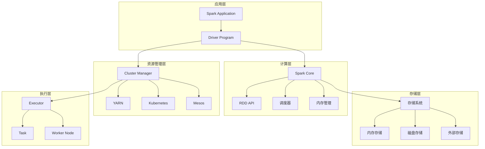
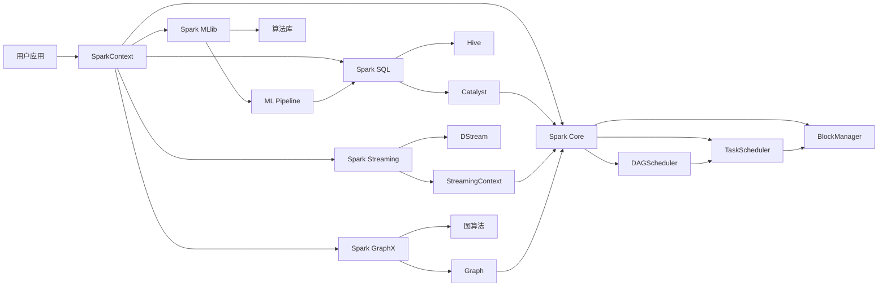

# Spark 架构与模块分析

## 高层架构图

### 整体架构



### 分层架构详解

#### 1. 应用层 (Application Layer)
- **Spark Application**: 用户编写的应用程序
- **Driver Program**: 应用程序的主进程，负责调度和协调

#### 2. 计算层 (Computation Layer)
- **Spark Core**: 核心计算引擎
- **RDD API**: 弹性分布式数据集抽象
- **调度器**: DAG 调度和任务调度
- **内存管理**: 统一内存管理

#### 3. 存储层 (Storage Layer)
- **内存存储**: 堆内存和堆外内存
- **磁盘存储**: 本地磁盘和分布式存储
- **外部存储**: HDFS、S3、HBase 等

#### 4. 资源管理层 (Resource Management Layer)
- **Cluster Manager**: 集群资源管理器
- **YARN**: Hadoop 资源管理器
- **Kubernetes**: 容器编排平台
- **Mesos**: 分布式系统内核

#### 5. 执行层 (Execution Layer)
- **Executor**: 执行器进程
- **Task**: 具体任务
- **Worker Node**: 工作节点

## 核心模块拆解

### 1. Spark Core 模块

#### 核心职责 (Responsibility)
Spark Core 是 Spark 的核心计算引擎，提供：
- **RDD 抽象**: 弹性分布式数据集
- **任务调度**: DAG 调度和任务调度
- **内存管理**: 统一内存管理
- **容错机制**: 故障恢复和重试
- **网络通信**: 节点间数据传输

#### 关键数据结构 (Data Structures)

##### RDD (Resilient Distributed Dataset)
```scala
abstract class RDD[T: ClassTag](
    @transient private var _sc: SparkContext,
    @transient private var deps: Seq[Dependency[_]]
) extends Serializable with Logging {
  
  // RDD 的核心属性
  def compute(split: Partition, context: TaskContext): Iterator[T]
  def getPartitions: Array[Partition]
  def getDependencies: Seq[Dependency[_]] = deps
  def getPreferredLocations(split: Partition): Seq[String] = Nil
}
```

##### Partition (分区)
```scala
trait Partition extends Serializable {
  def index: Int
  override def hashCode(): Int = index
}
```

##### Dependency (依赖关系)
```scala
abstract class Dependency[T] extends Serializable {
  def rdd: RDD[T]
}

// 窄依赖：父 RDD 的每个分区最多被一个子 RDD 分区使用
class OneToOneDependency[T](rdd: RDD[T]) extends NarrowDependency[T](rdd)

// 宽依赖：父 RDD 的分区被多个子 RDD 分区使用
class ShuffleDependency[K: ClassTag, V: ClassTag, C: ClassTag](
    @transient private val _rdd: RDD[_ <: Product2[K, V]],
    val partitioner: Partitioner,
    val serializer: Serializer = SparkEnv.get.serializer,
    val keyOrdering: Option[Ordering[K]] = None,
    val aggregator: Option[Aggregator[K, V, C]] = None,
    val mapSideCombine: Boolean = false)
  extends Dependency[Product2[K, V]]
```

#### 主要接口 (Interfaces)

##### SparkContext
```scala
class SparkContext(config: SparkConf) extends Logging {
  // 创建 RDD
  def textFile(path: String): RDD[String]
  def parallelize[T](seq: Seq[T]): RDD[T]
  def makeRDD[T](seq: Seq[T]): RDD[T]
  
  // 提交作业
  def runJob[T, U: ClassTag](
      rdd: RDD[T],
      func: Iterator[T] => U,
      partitions: Seq[Int]): Array[U]
  
  // 配置管理
  def getConf: SparkConf
  def setLocalProperty(key: String, value: String): Unit
}
```

##### RDD 转换操作
```scala
// 转换操作（返回新的 RDD）
def map[U: ClassTag](f: T => U): RDD[U]
def filter(f: T => Boolean): RDD[T]
def flatMap[U: ClassTag](f: T => TraversableOnce[U]): RDD[U]
def reduceByKey(func: (V, V) => V): RDD[(K, V)]

// 行动操作（触发计算）
def collect(): Array[T]
def count(): Long
def take(num: Int): Array[T]
def foreach(f: T => Unit): Unit
```

#### 依赖关系 (Dependencies)
- **DAGScheduler**: 依赖 DAGScheduler 进行作业调度
- **TaskScheduler**: 依赖 TaskScheduler 进行任务调度
- **BlockManager**: 依赖 BlockManager 进行数据存储
- **ShuffleManager**: 依赖 ShuffleManager 进行数据洗牌

### 2. Spark SQL 模块

#### 核心职责 (Responsibility)
Spark SQL 提供结构化数据处理能力：
- **DataFrame/Dataset API**: 结构化数据抽象
- **SQL 查询**: 标准 SQL 支持
- **Catalyst 优化器**: 查询优化
- **数据源集成**: 各种数据源连接器
- **Hive 集成**: Hive 兼容性

#### 关键数据结构 (Data Structures)

##### DataFrame
```scala
class Dataset[T] private[sql](
    @transient val sparkSession: SparkSession,
    @transient val queryExecution: QueryExecution,
    encoder: Encoder[T])
  extends Serializable {
  
  // DataFrame 操作
  def select(cols: Column*): DataFrame
  def where(condition: Column): DataFrame
  def groupBy(cols: Column*): RelationalGroupedDataset
  def orderBy(sortExprs: Column*): Dataset[T]
}
```

##### LogicalPlan
```scala
abstract class LogicalPlan extends QueryPlan[LogicalPlan] {
  def children: Seq[LogicalPlan]
  def output: Seq[Attribute]
  def maxRows: Option[Long]
  def maxRowsPerPartition: Option[Long]
}
```

##### PhysicalPlan
```scala
abstract class SparkPlan extends QueryPlan[SparkPlan] with Logging {
  def children: Seq[SparkPlan]
  def output: Seq[Attribute]
  def execute(): RDD[InternalRow]
}
```

#### 主要接口 (Interfaces)

##### SparkSession
```scala
class SparkSession private(
    @transient val sparkContext: SparkContext,
    @transient private val existingSharedState: Option[SharedState],
    @transient private val parentSessionState: Option[SessionState],
    @transient private[sql] val extensions: SparkSessionExtensions)
  extends Serializable with Closeable with Logging {
  
  // SQL 执行
  def sql(sqlText: String): DataFrame
  
  // DataFrame 创建
  def createDataFrame[A <: Product : TypeTag](data: Seq[A]): DataFrame
  def read: DataFrameReader
  
  // 配置管理
  def conf: RuntimeConfig
}
```

##### DataFrameReader
```scala
class DataFrameReader private[sql](sparkSession: SparkSession) {
  def format(source: String): DataFrameReader
  def option(key: String, value: String): DataFrameReader
  def load(paths: String*): DataFrame
  def table(tableName: String): DataFrame
}
```

#### 依赖关系 (Dependencies)
- **Catalyst**: 依赖 Catalyst 进行查询优化
- **Hive**: 依赖 Hive 进行元数据管理
- **Data Sources**: 依赖各种数据源连接器

### 3. Spark Streaming 模块

#### 核心职责 (Responsibility)
Spark Streaming 提供流式数据处理能力：
- **DStream API**: 离散化流抽象
- **微批处理**: 将流数据转换为小批次处理
- **窗口操作**: 滑动窗口和滚动窗口
- **状态管理**: 有状态流处理
- **容错机制**: 流处理容错

#### 关键数据结构 (Data Structures)

##### DStream (Discretized Stream)
```scala
abstract class DStream[T: ClassTag] (
    @transient private[streaming] var ssc: StreamingContext,
    @transient private[streaming] var dep: DStream[T]
  ) extends Serializable with Logging {
  
  // DStream 操作
  def map[U: ClassTag](mapFunc: T => U): DStream[U]
  def filter(filterFunc: T => Boolean): DStream[T]
  def flatMap[U: ClassTag](flatMapFunc: T => Traversable[U]): DStream[U]
  def reduce(reduceFunc: (T, T) => T): DStream[T]
}
```

##### StreamingContext
```scala
class StreamingContext private[streaming] (
    _sc: SparkContext,
    _cp: Checkpoint,
    _batchDur: Duration
  ) extends Serializable with Logging {
  
  // 启动和停止
  def start(): Unit
  def stop(stopSparkContext: Boolean = true): Unit
  def awaitTermination(): Unit
  
  // DStream 创建
  def textFileStream(directory: String): DStream[String]
  def socketTextStream(hostname: String, port: Int): DStream[String]
}
```

#### 主要接口 (Interfaces)

##### 输入 DStream
```scala
// 文件流
def textFileStream(directory: String): DStream[String]

// Socket 流
def socketTextStream(hostname: String, port: Int): DStream[String]

// Kafka 流
def createDirectStream[K, V](
    topics: Set[String],
    kafkaParams: Map[String, String],
    fromOffsets: Map[TopicPartition, Long]): InputDStream[ConsumerRecord[K, V]]
```

##### 窗口操作
```scala
def window(windowDuration: Duration): DStream[T]
def reduceByWindow(
    reduceFunc: (T, T) => T,
    windowDuration: Duration,
    slideDuration: Duration): DStream[T]
```

#### 依赖关系 (Dependencies)
- **Spark Core**: 依赖 Spark Core 进行批处理
- **Kafka**: 依赖 Kafka 进行消息队列
- **Checkpoint**: 依赖 Checkpoint 进行状态恢复

### 4. Spark MLlib 模块

#### 核心职责 (Responsibility)
Spark MLlib 提供机器学习算法库：
- **算法库**: 分类、回归、聚类、推荐等算法
- **特征工程**: 特征提取、转换、选择
- **模型评估**: 模型性能评估
- **管道**: 机器学习工作流
- **模型持久化**: 模型保存和加载

#### 关键数据结构 (Data Structures)

##### Pipeline
```scala
class Pipeline(override val uid: String) extends Estimator[PipelineModel] {
  def setStages(value: Array[PipelineStage]): Pipeline
  def fit(dataset: Dataset[_]): PipelineModel
}
```

##### Transformer
```scala
trait Transformer extends PipelineStage {
  def transform(dataset: Dataset[_]): DataFrame
}
```

##### Estimator
```scala
trait Estimator[M <: Model[M]] extends PipelineStage {
  def fit(dataset: Dataset[_]): M
}
```

#### 主要接口 (Interfaces)

##### 算法接口
```scala
// 分类算法
class LogisticRegression(override val uid: String)
  extends ProbabilisticClassifier[Vector, LogisticRegression, LogisticRegressionModel]

// 回归算法
class LinearRegression(override val uid: String)
  extends Regressor[Vector, LinearRegression, LinearRegressionModel]

// 聚类算法
class KMeans(override val uid: String)
  extends Estimator[KMeansModel] with KMeansParams
```

##### 特征工程
```scala
// 特征提取
class TF(override val uid: String)
  extends Transformer with HasInputCol with HasOutputCol

// 特征转换
class StandardScaler(override val uid: String)
  extends Estimator[StandardScalerModel] with StandardScalerParams
```

#### 依赖关系 (Dependencies)
- **Spark SQL**: 依赖 Spark SQL 进行数据处理
- **BLAS/LAPACK**: 依赖线性代数库
- **Breeze**: 依赖数值计算库

### 5. Spark GraphX 模块

#### 核心职责 (Responsibility)
Spark GraphX 提供图计算能力：
- **图抽象**: 顶点和边的抽象
- **图算法**: 图遍历、最短路径、连通分量等
- **图操作**: 图变换和聚合
- **图存储**: 图数据存储和分区
- **图可视化**: 图结果可视化

#### 关键数据结构 (Data Structures)

##### Graph
```scala
abstract class Graph[VD, ED] {
  val vertices: VertexRDD[VD]
  val edges: EdgeRDD[ED]
  
  def mapVertices[VD2: ClassTag](map: (VertexId, VD) => VD2): Graph[VD2, ED]
  def mapEdges[ED2: ClassTag](map: Edge[ED] => ED2): Graph[VD, ED2]
  def subgraph(epred: EdgeTriplet[VD, ED] => Boolean,
               vpred: (VertexId, VD) => Boolean): Graph[VD, ED]
}
```

##### VertexRDD
```scala
class VertexRDD[VD] private(
    val partitionsRDD: RDD[(VertexId, VD)]
  ) extends RDD[(VertexId, VD)](partitionsRDD.context, List(new OneToOneDependency(partitionsRDD))) {
  
  def mapValues[VD2: ClassTag](f: VD => VD2): VertexRDD[VD2]
  def innerJoin[U: ClassTag, VD2: ClassTag](other: RDD[(VertexId, U)])(f: (VertexId, VD, U) => VD2): VertexRDD[VD2]
}
```

##### EdgeRDD
```scala
class EdgeRDD[ED] private(
    val partitionsRDD: RDD[EdgePartition[ED]]
  ) extends RDD[Edge[ED]](partitionsRDD.context, List(new OneToOneDependency(partitionsRDD))) {
  
  def mapValues[ED2: ClassTag](f: ED => ED2): EdgeRDD[ED2]
  def reverse: EdgeRDD[ED]
}
```

#### 主要接口 (Interfaces)

##### 图构建
```scala
object Graph {
  def apply[VD: ClassTag, ED: ClassTag](
      vertices: RDD[(VertexId, VD)],
      edges: RDD[Edge[ED]]): Graph[VD, ED]
      
  def fromEdges[VD: ClassTag, ED: ClassTag](
      edges: RDD[Edge[ED]],
      defaultValue: VD): Graph[VD, ED]
}
```

##### 图算法
```scala
// PageRank
def pageRank(tol: Double, resetProb: Double = 0.15): Graph[Double, Double]

// 连通分量
def connectedComponents(): Graph[VertexId, ED]

// 最短路径
def shortestPaths(landmarks: Seq[VertexId]): Graph[Map[VertexId, Int], ED]
```

#### 依赖关系 (Dependencies)
- **Spark Core**: 依赖 Spark Core 进行分布式计算
- **Pregel**: 依赖 Pregel 模型进行图迭代

## 模块间交互关系

### 数据流图



### 依赖关系矩阵

| 模块 | Spark Core | Spark SQL | Spark Streaming | Spark MLlib | Spark GraphX |
|------|------------|-----------|-----------------|-------------|--------------|
| Spark Core | - | 基础依赖 | 基础依赖 | 基础依赖 | 基础依赖 |
| Spark SQL | 使用 RDD | - | 数据源 | 数据处理 | 图数据 |
| Spark Streaming | 使用 RDD | 结构化流 | - | 流式 ML | 流式图 |
| Spark MLlib | 使用 RDD | 使用 DataFrame | 流式处理 | - | 图 ML |
| Spark GraphX | 使用 RDD | 图数据 | 图流 | 图 ML | - |

## 设计模式分析

### 1. 工厂模式
- **RDD 创建**: 通过 SparkContext 创建不同类型的 RDD
- **调度器创建**: 根据配置创建不同的调度器

### 2. 观察者模式
- **事件驱动**: DAGScheduler 监听作业提交事件
- **状态变化**: 监听任务状态变化

### 3. 策略模式
- **调度策略**: 不同的任务调度策略
- **序列化策略**: 不同的数据序列化方式

### 4. 模板方法模式
- **RDD 操作**: 定义操作框架，子类实现具体逻辑
- **算法框架**: 定义算法框架，具体算法实现细节

### 5. 代理模式
- **远程对象**: 代理远程执行器
- **数据访问**: 代理数据块访问