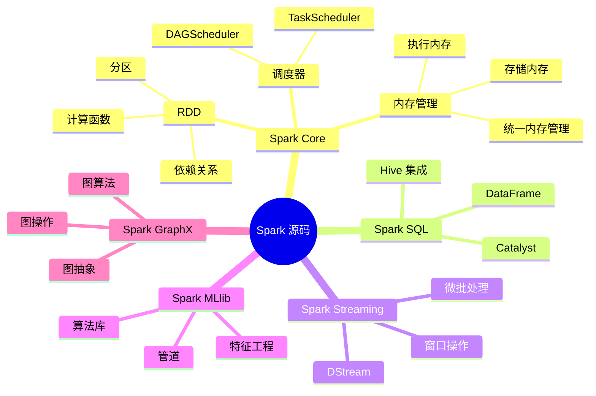

# Spark 实践与贡献指南

## 代码实验

### 1. 基础实验：理解 RDD 生命周期

#### 实验目标
通过修改源码添加日志，理解 RDD 的创建、转换和计算过程。

#### 实验步骤

##### 步骤 1：添加调试日志
```scala
// 在 core/src/main/scala/org/apache/spark/rdd/RDD.scala 中添加日志
class RDD[T: ClassTag](
    @transient private var _sc: SparkContext,
    @transient private var deps: Seq[Dependency[_]]
) extends Serializable with Logging {
  
  // 添加构造函数日志
  logInfo(s"Creating RDD with id: $id, dependencies: ${deps.length}")
  
  def map[U: ClassTag](f: T => U): RDD[U] = {
    logInfo(s"Applying map transformation to RDD $id")
    new MapPartitionsRDD[U, T](this, (context, pid, iter) => iter.map(f))
  }
  
  def collect(): Array[T] = {
    logInfo(s"Triggering collect action on RDD $id")
    val results = sc.runJob(this, (iter: Iterator[T]) => iter.toArray)
    Array.concat(results: _*)
  }
}
```

##### 步骤 2：编译和运行
```bash
# 编译修改后的代码
./build/mvn -pl core -am clean package

# 运行测试程序
./bin/spark-shell --master local[2]
```

##### 步骤 3：观察日志输出
```scala
// 在 spark-shell 中运行
val rdd = sc.parallelize(1 to 10)
val mapped = rdd.map(x => x * 2)
val result = mapped.collect()
```

#### 预期结果
观察控制台输出，理解：
- RDD 创建时的日志
- 转换操作时的日志
- 行动操作时的日志

### 2. 中级实验：自定义 RDD

#### 实验目标
实现一个自定义的 RDD 类，理解 RDD 抽象的核心概念。

#### 实验代码

##### 创建自定义 RDD
```scala
// 在 examples/src/main/scala/org/apache/spark/examples/ 下创建 CustomRDD.scala
package org.apache.spark.examples

import org.apache.spark.{Partition, SparkContext, TaskContext}
import org.apache.spark.rdd.RDD

class CustomRDD(
    sc: SparkContext,
    val data: Array[Int],
    numPartitions: Int
) extends RDD[Int](sc, Nil) {
  
  override def compute(split: Partition, context: TaskContext): Iterator[Int] = {
    val customPartition = split.asInstanceOf[CustomPartition]
    val start = customPartition.start
    val end = customPartition.end
    data.slice(start, end).iterator
  }
  
  override def getPartitions: Array[Partition] = {
    val partitionSize = data.length / numPartitions
    (0 until numPartitions).map { i =>
      val start = i * partitionSize
      val end = if (i == numPartitions - 1) data.length else (i + 1) * partitionSize
      new CustomPartition(i, start, end)
    }.toArray
  }
}

class CustomPartition(
    val index: Int,
    val start: Int,
    val end: Int
) extends Partition
```

##### 测试自定义 RDD
```scala
// 在 spark-shell 中测试
import org.apache.spark.examples._

val data = Array(1, 2, 3, 4, 5, 6, 7, 8, 9, 10)
val customRDD = new CustomRDD(sc, data, 2)
val result = customRDD.map(x => x * x).collect()
println(result.mkString(", "))
```

### 3. 高级实验：自定义调度策略

#### 实验目标
实现一个自定义的任务调度策略，理解调度器的工作原理。

#### 实验代码

##### 创建自定义调度器
```scala
// 在 core/src/main/scala/org/apache/spark/scheduler/ 下创建 CustomScheduler.scala
package org.apache.spark.scheduler

import org.apache.spark.{SparkConf, SparkContext}
import org.apache.spark.scheduler.cluster.CoarseGrainedSchedulerBackend

class CustomScheduler(
    sc: SparkContext,
    taskScheduler: TaskScheduler
) extends DAGScheduler(sc, taskScheduler) {
  
  override def submitJob[T, U](
      rdd: RDD[T],
      func: (TaskContext, Iterator[T]) => U,
      partitions: Seq[Int],
      callSite: CallSite,
      resultHandler: (Int, U) => Unit,
      properties: Properties): JobWaiter[U] = {
    
    logInfo(s"Custom scheduler submitting job for RDD ${rdd.id}")
    
    // 添加自定义逻辑
    val jobId = nextJobId.getAndIncrement()
    val waiter = new JobWaiter(this, jobId, partitions.size, resultHandler)
    
    eventProcessLoop.post(JobSubmitted(
      jobId, rdd, func2, partitions.toArray, callSite, waiter, properties))
    
    waiter
  }
}
```

## 编写注释与文档

### 1. 代码注释规范

#### 类级别注释
```scala
/**
 * RDD (Resilient Distributed Dataset) 是 Spark 的核心抽象。
 * 
 * RDD 是一个不可变的、分区的记录集合，可以并行操作。
 * 每个 RDD 都有以下五个核心属性：
 * - 分区列表
 * - 计算函数
 * - 依赖关系
 * - 分区器（可选）
 * - 首选位置（可选）
 * 
 * @param _sc SparkContext，用于创建 RDD
 * @param deps 依赖关系列表
 * @tparam T RDD 中元素的类型
 */
abstract class RDD[T: ClassTag](
    @transient private var _sc: SparkContext,
    @transient private var deps: Seq[Dependency[_]]
) extends Serializable with Logging {
```

#### 方法级别注释
```scala
/**
 * 对 RDD 中的每个元素应用函数 f，返回新的 RDD。
 * 
 * 这是一个转换操作，不会立即执行，而是返回一个新的 RDD。
 * 只有当遇到行动操作时才会真正执行计算。
 * 
 * @param f 应用到每个元素的函数
 * @tparam U 返回 RDD 的元素类型
 * @return 包含转换后元素的新 RDD
 * 
 * @example
 * {{{
 * val rdd = sc.parallelize(1 to 10)
 * val doubled = rdd.map(x => x * 2)
 * doubled.collect() // Array(2, 4, 6, 8, 10, 12, 14, 16, 18, 20)
 * }}}
 */
def map[U: ClassTag](f: T => U): RDD[U] = {
  new MapPartitionsRDD[U, T](this, (context, pid, iter) => iter.map(f))
}
```

### 2. 学习笔记模板

#### 模块学习笔记
```markdown
# Spark Core 模块学习笔记

## 概述
Spark Core 是 Spark 的核心计算引擎，提供了 RDD 抽象和分布式计算能力。

## 核心概念

### RDD (Resilient Distributed Dataset)
- **定义**: 弹性分布式数据集
- **特点**: 不可变、分区、可并行计算
- **容错**: 通过血缘关系进行故障恢复

### 依赖关系
- **窄依赖**: 父 RDD 的每个分区最多被一个子 RDD 分区使用
- **宽依赖**: 父 RDD 的分区被多个子 RDD 分区使用（Shuffle）

## 关键类分析

### SparkContext
- **作用**: Spark 应用程序的入口点
- **职责**: 创建 RDD、提交作业、管理配置
- **位置**: `core/src/main/scala/org/apache/spark/SparkContext.scala`

### DAGScheduler
- **作用**: 将作业分解为阶段
- **职责**: 构建 DAG、划分阶段、提交任务
- **位置**: `core/src/main/scala/org/apache/spark/scheduler/DAGScheduler.scala`

## 设计模式

### 工厂模式
- SparkContext 作为 RDD 的工厂
- 根据数据源类型创建不同的 RDD

### 观察者模式
- DAGScheduler 监听作业提交事件
- TaskScheduler 监听任务完成事件

## 学习心得
1. RDD 的不可变性设计很巧妙，便于容错和优化
2. 依赖关系的设计是理解 Spark 调度的关键
3. 分阶段调度是 Spark 性能优化的核心

## 待深入问题
1. Shuffle 的具体实现机制
2. 内存管理的详细策略
3. 容错恢复的具体流程
```

## 代码复现

### 1. 实现简单的 RDD

#### 目标
用自己的代码实现 RDD 的核心功能，加深理解。

#### 实现代码
```scala
// 简化的 RDD 实现
trait SimpleRDD[T] {
  def partitions: Array[SimplePartition]
  def compute(split: SimplePartition): Iterator[T]
  def map[U](f: T => U): SimpleRDD[U]
  def filter(f: T => Boolean): SimpleRDD[T]
  def collect(): Array[T]
}

case class SimplePartition(index: Int, data: Array[Any])

class SimpleMapRDD[T, U](
    parent: SimpleRDD[T],
    f: T => U
) extends SimpleRDD[U] {
  
  def partitions: Array[SimplePartition] = parent.partitions
  
  def compute(split: SimplePartition): Iterator[U] = {
    parent.compute(split).map(f)
  }
  
  def map[V](g: U => V): SimpleRDD[V] = {
    new SimpleMapRDD(this, g)
  }
  
  def filter(p: U => Boolean): SimpleRDD[U] = {
    new SimpleFilterRDD(this, p)
  }
  
  def collect(): Array[U] = {
    partitions.flatMap(compute(_).toArray)
  }
}

class SimpleFilterRDD[T](
    parent: SimpleRDD[T],
    f: T => Boolean
) extends SimpleRDD[T] {
  
  def partitions: Array[SimplePartition] = parent.partitions
  
  def compute(split: SimplePartition): Iterator[T] = {
    parent.compute(split).filter(f)
  }
  
  def map[U](g: T => U): SimpleRDD[U] = {
    new SimpleMapRDD(this, g)
  }
  
  def filter(p: T => Boolean): SimpleRDD[T] = {
    new SimpleFilterRDD(this, p)
  }
  
  def collect(): Array[T] = {
    partitions.flatMap(compute(_).toArray)
  }
}
```

### 2. 实现简单的调度器

#### 目标
理解任务调度的基本原理。

#### 实现代码
```scala
// 简化的调度器实现
trait SimpleScheduler {
  def submitJob[T](rdd: SimpleRDD[T]): Array[T]
}

class SimpleLocalScheduler extends SimpleScheduler {
  def submitJob[T](rdd: SimpleRDD[T]): Array[T] = {
    // 简单的本地执行
    rdd.collect()
  }
}

class SimpleParallelScheduler(numThreads: Int) extends SimpleScheduler {
  def submitJob[T](rdd: SimpleRDD[T]): Array[T] = {
    import scala.concurrent._
    import scala.concurrent.duration._
    import ExecutionContext.Implicits.global
    
    val futures = rdd.partitions.map { partition =>
      Future {
        rdd.compute(partition).toArray
      }
    }
    
    val results = Await.result(Future.sequence(futures), 30.seconds)
    results.flatten.asInstanceOf[Array[T]]
  }
}
```

## 从社区开始

### 1. 找到 "Good First Issue"

#### 查找方法
1. **GitHub Issues**
   ```bash
   # 在 Spark 仓库中搜索
   # 标签: "good first issue", "beginner", "help wanted"
   ```

2. **JIRA 问题跟踪**
   - 访问 [Spark JIRA](https://issues.apache.org/jira/browse/SPARK)
   - 搜索 "good first issue" 标签

3. **邮件列表**
   - 订阅 [dev@spark.apache.org](mailto:dev@spark.apache.org)
   - 关注新人友好的问题

#### 推荐的新手问题类型
- **文档改进**: 更新文档、添加示例
- **测试用例**: 添加单元测试、集成测试
- **小 Bug 修复**: 简单的逻辑错误修复
- **性能优化**: 小的性能改进

### 2. 修复简单的 Bug

#### 步骤 1：复现问题
```bash
# 1. 克隆代码
git clone https://github.com/apache/spark.git
cd spark

# 2. 切换到问题分支
git checkout -b fix-simple-bug

# 3. 复现问题
./bin/spark-shell
# 运行能复现问题的代码
```

#### 步骤 2：定位问题
```bash
# 1. 查看相关代码
find . -name "*.scala" -exec grep -l "problematic_function" {} \;

# 2. 添加调试日志
# 在相关方法中添加 logInfo 或 println

# 3. 运行测试
./build/mvn test -Dtest=ProblematicTest
```

#### 步骤 3：修复问题
```scala
// 示例：修复一个简单的空指针异常
// 修复前
def processData(data: Option[String]): String = {
  data.get  // 可能抛出 NullPointerException
}

// 修复后
def processData(data: Option[String]): String = {
  data.getOrElse("")  // 安全处理
}
```

### 3. 提交 Pull Request

#### 步骤 1：准备代码
```bash
# 1. 确保代码通过测试
./build/mvn clean test

# 2. 检查代码风格
./dev/lint-scala

# 3. 提交代码
git add .
git commit -m "Fix simple bug in XXX module"
```

#### 步骤 2：创建 PR
1. **Fork 仓库**: 在 GitHub 上 fork Spark 仓库
2. **推送分支**: 将修复分支推送到你的 fork
3. **创建 PR**: 在 GitHub 上创建 Pull Request

#### 步骤 3：PR 描述模板
```markdown
## What changes were proposed in this pull request?

Brief description of the changes.

## How was this patch tested?

- [ ] Unit tests
- [ ] Integration tests
- [ ] Manual testing

## Related issues

Fixes #1234

## Checklist

- [ ] Code follows the style guidelines
- [ ] Self-review completed
- [ ] Documentation updated
- [ ] Tests added/updated
```

## 提出问题

### 1. 问题记录模板

#### 技术问题记录
```markdown
# 问题记录

## 问题描述
[详细描述遇到的问题]

## 环境信息
- Spark 版本: 3.5.0
- Scala 版本: 2.12.18
- Java 版本: OpenJDK 8
- 操作系统: Ubuntu 20.04

## 复现步骤
1. [步骤 1]
2. [步骤 2]
3. [步骤 3]

## 期望结果
[描述期望的行为]

## 实际结果
[描述实际的行为]

## 相关代码
```scala
// 相关的代码片段
```

## 尝试的解决方案
1. [方案 1] - 结果
2. [方案 2] - 结果

## 参考资料
- [相关文档链接]
- [相关讨论链接]
```

### 2. 问题分类

#### 按难度分类
- **初级问题**: 概念理解、API 使用
- **中级问题**: 性能优化、配置调优
- **高级问题**: 源码分析、架构设计

#### 按类型分类
- **概念问题**: 不理解某个概念
- **实现问题**: 不知道如何实现某个功能
- **性能问题**: 性能不达标
- **Bug 问题**: 程序行为异常

### 3. 寻找答案的方法

#### 官方资源
1. **官方文档**: [Spark 官方文档](https://spark.apache.org/docs/latest/)
2. **API 文档**: [Scaladoc](https://spark.apache.org/docs/latest/api/scala/index.html)
3. **示例代码**: `examples/` 目录

#### 社区资源
1. **Stack Overflow**: [Spark 标签](https://stackoverflow.com/questions/tagged/apache-spark)
2. **邮件列表**: [用户邮件列表](https://spark.apache.org/community.html#mailing-lists)
3. **GitHub Issues**: [Spark Issues](https://github.com/apache/spark/issues)

#### 学习资源
1. **书籍**: 《Spark 权威指南》、《Spark 快速大数据分析》
2. **课程**: Coursera、edX 上的 Spark 课程
3. **博客**: 技术博客和文章

### 4. 向社区提问

#### 提问前准备
1. **搜索现有问题**: 避免重复提问
2. **准备最小复现**: 提供最小的代码示例
3. **收集环境信息**: 版本、配置等
4. **尝试自己解决**: 先尝试各种解决方案

#### 提问模板
```markdown
Subject: [Spark Core] Question about RDD lineage optimization

Hi Spark community,

I'm learning Spark source code and have a question about RDD lineage optimization.

**Question:**
[详细描述问题]

**Context:**
- I'm studying the RDD implementation in Spark Core
- I found this code in `core/src/main/scala/org/apache/spark/rdd/RDD.scala`
- I don't understand how the lineage optimization works

**Code:**
```scala
// 相关代码
```

**What I've tried:**
1. [尝试 1]
2. [尝试 2]

**Environment:**
- Spark version: 3.5.0
- Scala version: 2.12.18

Could anyone help me understand this? Thanks!
```

#### 提问礼仪
1. **礼貌用语**: 使用礼貌的语言
2. **详细描述**: 提供足够的信息
3. **感谢回复**: 对帮助表示感谢
4. **分享解决方案**: 如果解决了，分享解决方案

## 学习总结

### 1. 阶段性总结

#### 每周总结模板
```markdown
# 第 X 周学习总结

## 本周学习内容
1. [学习内容 1]
2. [学习内容 2]
3. [学习内容 3]

## 关键收获
1. [收获 1]
2. [收获 2]

## 遇到的问题
1. [问题 1] - 解决方案
2. [问题 2] - 待解决

## 下周计划
1. [计划 1]
2. [计划 2]

## 学习心得
[个人感悟和思考]
```

### 2. 知识体系构建

#### 核心概念图


### 3. 实践项目建议

#### 入门项目
1. **自定义 RDD**: 实现一个简单的自定义 RDD
2. **性能分析工具**: 开发一个 Spark 应用性能分析工具
3. **监控插件**: 为 Spark UI 开发一个监控插件

#### 进阶项目
1. **自定义调度器**: 实现一个自定义的任务调度策略
2. **数据源连接器**: 开发一个新的数据源连接器
3. **优化器插件**: 为 Catalyst 开发一个优化规则

#### 高级项目
1. **分布式算法**: 在 Spark 上实现复杂的分布式算法
2. **机器学习算法**: 实现新的机器学习算法
3. **流处理引擎**: 基于 Spark 开发流处理引擎

### 4. 持续学习建议

#### 学习资源更新
1. **关注版本更新**: 定期查看 Spark 新版本特性
2. **阅读技术博客**: 关注 Spark 相关的技术博客
3. **参与技术会议**: 参加 Spark Summit 等技术会议

#### 实践建议
1. **定期回顾**: 定期回顾已学内容，巩固理解
2. **动手实践**: 多动手实践，理论结合实践
3. **分享交流**: 与他人分享学习心得，互相学习

#### 长期规划
1. **深入专业领域**: 选择感兴趣的方向深入研究
2. **参与开源贡献**: 持续参与 Spark 社区贡献
3. **技术分享**: 通过博客、演讲等方式分享技术